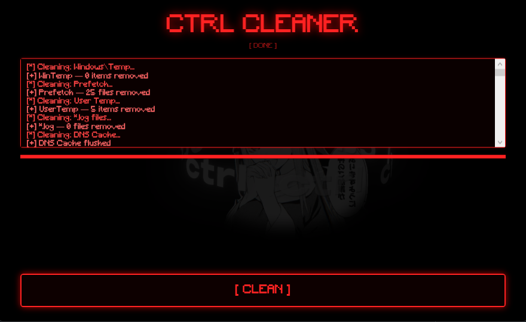

# CTRL Cleaner

A powerful Windows system cleaner built in C# WPF (.NET 8), compiled into a single self-contained `.exe` with no external dependencies — not even the background video, which is embedded directly inside the binary.

---

## Features

- Cleans 40+ system folders (Temp, Prefetch, Logs, Caches, Thumbnails, etc.)
- Clears all Windows Event Logs via Win32 API and `wevtutil`
- Empties the Recycle Bin silently
- Flushes DNS cache
- Cleans Firefox profile data (cookies, cache, history databases)
- Deep registry cleaning — MRUs, RunMRU, TypedPaths, UserAssist, JumpLists, WinRAR history and more
- Cleans Windows Update download cache (stops/restarts WU services automatically)
- Trace bypass operations: clears JumpLists, AppCompatCache (ShimCache) and USN Journal
- All file deletions skip locked files and continue — nothing hangs

---

## UI

- Embedded MP4 background video (looping, muted)
- Minecraft font, red neon theme (#FF2222)
- Real-time log box with color-coded output
- Progress bar tracking all cleaning steps

---

## Build

Requires [.NET 8 SDK](https://dotnet.microsoft.com/download).

build.bat

Output: `dist\CtrlCleaner.exe` — single file, fully self-contained, no runtime required on target machine.

> Run as Administrator for full cleaning capability.

---

## What gets cleaned

| Category | Details |
|---|---|
| System Temp | `Windows\Temp`, `%TEMP%`, `LocalAppData\Temp` |
| Prefetch | `.pf` and `.db` files |
| Log files | `*.log` across Windows, ProgramData, LocalAppData |
| Caches | WebCache, INetCache, D3DSCache, Explorer, Thumbnails |
| Browser data | IE history/cookies, Firefox profiles |
| Event Logs | All logs via Win32 API + wevtutil |
| Recycle Bin | Silent empty via Shell API |
| Registry | 29 MRU/history keys |
| Windows Update | `SoftwareDistribution\Download` |
| Traces | JumpLists, AppCompatCache, USN Journal |

---

## Tech Stack

- C# / WPF / .NET 8 (`net8.0-windows`)
- P/Invoke: `advapi32.dll` (Event Logs), `shell32.dll` (Recycle Bin)
- `Microsoft.Win32.Registry` for registry cleaning
- Self-contained single-file publish (`win-x64`)
- Embedded resources: MP4 video + Minecraft TTF font
